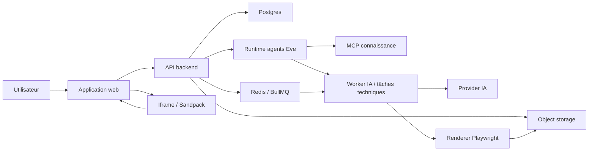
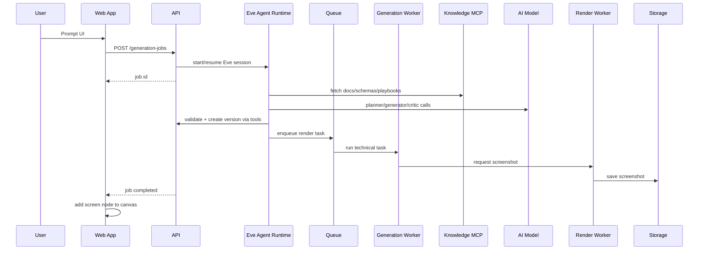

# Architecture

## Vue d'ensemble

Open Design Canvas est organisé autour de six surfaces:

- l'application web;
- l'API backend;
- le runtime agentique Eve;
- le MCP de connaissance interne;
- le worker de génération;
- le runtime de preview.

Le coeur du système est un modèle de design structuré. Les prompts, screenshots, HTML et React sont des artefacts liés à ce modèle.

## Modules frontend

### Project Shell

Responsabilités:

- navigation projet;
- layout principal;
- état global minimal;
- gestion des erreurs globales.

### Chat Panel

Responsabilités:

- saisie prompt;
- historique conversationnel local au projet;
- commandes rapides: générer, modifier, variantes, exporter;
- affichage des jobs en cours.

### Canvas Workspace

Responsabilités:

- rendu des nodes;
- zoom, pan, sélection;
- drag and drop;
- liens entre écrans;
- affichage screenshots et métadonnées.

### Preview Panel

Responsabilités:

- rendu iframe ou Sandpack;
- affichage erreurs;
- code view;
- responsive preview.

### Design System Panel

Responsabilités:

- édition DESIGN.md;
- tokens couleurs, typographie, spacing;
- application à une génération.

## Modules backend

### Projects API

Gère les projets, écrans, versions et canvas documents.

### Generation API

Crée des jobs asynchrones de génération, édition et variantes. Le backend reste propriétaire des statuts, ids, droits, versions et artefacts. Il peut déléguer l'orchestration à Eve, mais Eve ne devient pas la source de vérité produit.

### Agent Orchestration API

Responsabilités:

- démarrer ou reprendre une session Eve liée à un `GenerationJob`;
- transmettre le contexte strictement nécessaire;
- stocker `sessionId`, `continuationToken` et statut terminal;
- mapper les événements Eve vers les statuts de job existants;
- garder un fallback direct provider tant que l'intégration Eve est en beta.

### Artifact API

Sert les screenshots, bundles HTML, assets et exports.

### Export API

Construit des exports à partir du modèle de données.

## Workers

### Eve Agent Runtime

Responsabilités:

- orchestrer planner, generator, critic et exporter;
- appeler des tools typés et idempotents vers le backend;
- charger les skills de génération, critique et export;
- consulter le MCP de connaissance pour docs, schemas et playbooks;
- produire des résultats bornés, validables et persistés via le backend.

Le runtime Eve est isolé dans une app/package dédié. Il ne remplace pas Postgres, les contrats API, le stockage ou les workers de rendu.

### Generation Worker

Responsabilités:

- assembler le contexte;
- appeler le modèle IA;
- valider la sortie structurée;
- compiler vers HTML/React;
- créer une version.

Après intégration Eve, ce worker devient soit un fallback provider direct, soit un ensemble de tâches techniques appelées par les tools Eve.

### Render Worker

Responsabilités:

- lancer Playwright;
- rendre le HTML;
- capturer screenshot;
- capturer console/errors;
- stocker les artefacts.

### Critic Worker V2

Responsabilités:

- comparer screenshot, prompt et design system;
- produire une critique structurée;
- proposer ou appliquer des corrections.

### Knowledge MCP

Responsabilités:

- exposer `docs/`, ADRs, plans, schemas et playbooks aux agents;
- fournir une recherche bornée plutôt qu'un dump complet du repo;
- servir Eve via une connection MCP Streamable HTTP ou SSE;
- servir les agents de développement via un transport local si utile;
- exclure par défaut les données projet sensibles.

## Runtime de preview

Le runtime de preview doit être isolé de l'application hôte.

MVP:

- Sandpack pour React/Tailwind simple.
- Iframe sandbox pour HTML autonome.

V2:

- sous-domaine dédié;
- CSP stricte;
- postMessage typé;
- console bridge;
- capture erreurs runtime.

## Flux principal

## Choix de découpage

Le frontend ne doit pas porter la logique de génération. Il orchestre les états et affiche les artefacts. Le backend possède la logique de job, stockage et validation. Eve porte l'orchestration agentique, mais toutes les mutations produit passent par des tools idempotents vers le backend. Les workers isolent les opérations lentes ou dangereuses.
