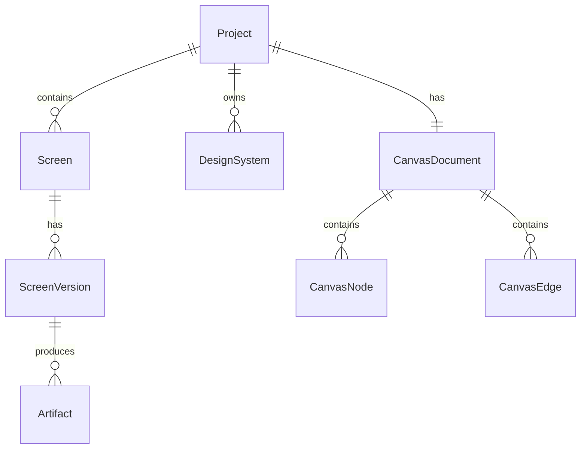

# Modèle de Données

## Principe

La source de vérité est un modèle structuré, pas le code généré. Le code, les screenshots et les exports sont des artefacts reproductibles depuis ce modèle.

## Entités principales



## Project

```ts
type Project = {
  id: string;
  name: string;
  slug: string;
  createdAt: string;
  updatedAt: string;
  defaultDesignSystemId: string | null;
};
```

## Screen

```ts
type Screen = {
  id: string;
  projectId: string;
  title: string;
  deviceType: "mobile" | "tablet" | "desktop" | "agnostic";
  currentVersionId: string;
  createdAt: string;
  updatedAt: string;
};
```

## ScreenVersion

```ts
type ScreenVersion = {
  id: string;
  screenId: string;
  versionNumber: number;
  sourcePrompt: string;
  operation: "generate" | "edit" | "variant" | "import";
  designSpec: DesignSpec;
  htmlCode: string;
  reactCode: string | null;
  screenshotArtifactId: string | null;
  parentVersionId: string | null;
  createdAt: string;
};
```

## DesignSpec

Le DesignSpec décrit l'écran de façon portable.

```ts
type DesignSpec = {
  schemaVersion: "1.0";
  title: string;
  deviceType: "mobile" | "tablet" | "desktop" | "agnostic";
  viewport: {
    width: number;
    height: number;
  };
  themeRefs: {
    designSystemId: string | null;
  };
  root: DesignNode;
  interactions: InteractionSpec[];
  assets: AssetRef[];
};
```

## DesignNode

```ts
type DesignNode = {
  id: string;
  type:
    | "frame"
    | "stack"
    | "text"
    | "button"
    | "input"
    | "image"
    | "card"
    | "chart"
    | "table"
    | "nav"
    | "icon"
    | "custom";
  name: string;
  layout: LayoutSpec;
  style: StyleSpec;
  content: ContentSpec;
  children: DesignNode[];
};
```

## LayoutSpec

```ts
type LayoutSpec = {
  position: "relative" | "absolute";
  x?: number;
  y?: number;
  width: number | "fill" | "hug";
  height: number | "fill" | "hug";
  direction?: "row" | "column";
  gap?: number;
  padding?: {
    top: number;
    right: number;
    bottom: number;
    left: number;
  };
  align?: "start" | "center" | "end" | "stretch";
  justify?: "start" | "center" | "end" | "between";
};
```

## StyleSpec

```ts
type StyleSpec = {
  background?: string;
  foreground?: string;
  borderColor?: string;
  borderWidth?: number;
  radius?: number;
  shadow?: string;
  opacity?: number;
  typography?: {
    token?: string;
    fontFamily?: string;
    fontSize?: number;
    fontWeight?: number;
    lineHeight?: number;
  };
};
```

## ContentSpec

```ts
type ContentSpec = {
  text?: string;
  inputHint?: string;
  src?: string;
  alt?: string;
  icon?: string;
  chart?: {
    type: "line" | "bar" | "area" | "pie";
    data: Record<string, string | number>[];
  };
};
```

## DesignSystem

```ts
type DesignSystem = {
  id: string;
  projectId: string;
  name: string;
  designMd: string;
  tokens: DesignTokens;
  createdAt: string;
  updatedAt: string;
};
```

## DesignTokens

```ts
type DesignTokens = {
  colors: Record<string, string>;
  typography: Record<string, {
    fontFamily: string;
    fontSize: string;
    lineHeight: string;
    fontWeight: string;
  }>;
  spacing: Record<string, string>;
  radius: Record<string, string>;
  shadows: Record<string, string>;
};
```

## CanvasDocument

```ts
type CanvasDocument = {
  id: string;
  projectId: string;
  schemaVersion: "1.0";
  nodes: CanvasNode[];
  edges: CanvasEdge[];
  viewport: {
    x: number;
    y: number;
    zoom: number;
  };
  updatedAt: string;
};
```

## CanvasNode

```ts
type CanvasNode = {
  id: string;
  type: "screen" | "prompt" | "image" | "code" | "note" | "designSystem";
  refId: string | null;
  x: number;
  y: number;
  width: number;
  height: number;
  title: string;
  body: string | null;
};
```

## CanvasEdge

```ts
type CanvasEdge = {
  id: string;
  sourceNodeId: string;
  targetNodeId: string;
  label: string | null;
  kind: "prototype" | "reference" | "variant" | "handoff";
};
```

## Artifact

```ts
type Artifact = {
  id: string;
  projectId: string;
  screenVersionId: string | null;
  type: "screenshot" | "html" | "reactZip" | "image" | "log" | "figmaPayload";
  storageKey: string;
  mimeType: string;
  byteSize: number;
  createdAt: string;
};
```

## Règles

- Toute modification d'écran crée une nouvelle ScreenVersion.
- Un Screen pointe vers une seule version courante.
- Le CanvasNode de type screen pointe vers Screen, pas vers ScreenVersion.
- Les exports pointent vers ScreenVersion pour rester reproductibles.
- Le DesignSpec doit être validé avant tout rendu.
