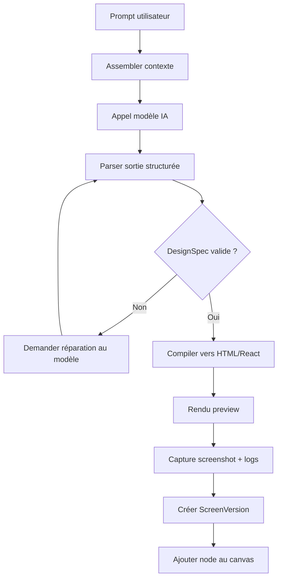
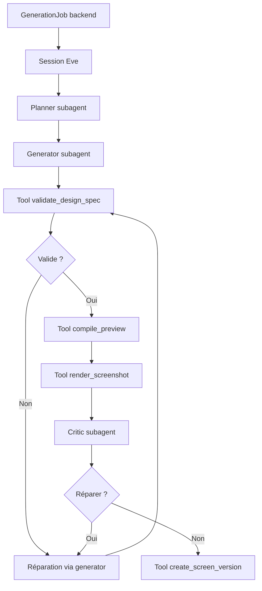

# Pipeline IA

## Objectif

Transformer une intention utilisateur en interface affichable, versionnée et exportable.

## Pipeline MVP



## Orchestration Eve

Le pipeline peut être orchestré par Eve sans déplacer la source de vérité produit.



Eve orchestre les étapes, mais les tools appellent le backend ou les packages partagés pour valider, compiler, rendre et persister. Le backend conserve `GenerationJob`, `ScreenVersion`, les artefacts et les droits utilisateur.

## Entrées possibles

### MVP

- prompt texte;
- device target;
- DESIGN.md;
- écran existant à modifier.

### V2

- image ou wireframe;
- URL;
- codebase;
- fichiers de design;
- screenshots concurrents;
- composants existants.

## Sortie attendue du modèle

Le modèle doit produire une réponse structurée.

```json
{
  "brief": {
    "goal": "Monitoring dashboard for a B2B SaaS product",
    "audience": "Operations teams",
    "tone": "Dense, technical, calm"
  },
  "designSpec": {
    "schemaVersion": "1.0",
    "title": "Operations Dashboard",
    "deviceType": "desktop",
    "viewport": { "width": 1440, "height": 1024 },
    "themeRefs": { "designSystemId": null },
    "root": {
      "id": "root",
      "type": "frame",
      "name": "Dashboard",
      "layout": { "position": "relative", "width": 1440, "height": 1024 },
      "style": { "background": "var(--color-background)" },
      "content": {},
      "children": []
    },
    "interactions": [],
    "assets": []
  }
}
```

## Validation

Chaque sortie passe par:

- validation JSON;
- validation Zod;
- validation de taille;
- validation des types de nodes;
- validation des références assets;
- validation du code généré si code fourni;
- interdiction des patterns dangereux.

## Réparation

Si la sortie est invalide:

1. conserver l'erreur exacte;
2. appeler le modèle avec le JSON invalide et l'erreur Zod;
3. demander une correction sans changer l'intention;
4. limiter à deux réparations automatiques;
5. marquer le job failed si la sortie reste invalide.

## Compilation

Le DesignSpec est compilé vers:

- HTML autonome;
- React/Tailwind;
- metadata de canvas;
- payload Figma plus tard.

Le compilateur doit être déterministe. Le même DesignSpec doit produire le même HTML, hors timestamps et ids d'artefacts.

## Critique visuelle V2

Le critic worker ou subagent Eve reçoit:

- prompt utilisateur;
- DESIGN.md;
- screenshot;
- erreurs console;
- DesignSpec.

Il retourne:

```ts
type VisualCritique = {
  score: number;
  issues: {
    severity: "low" | "medium" | "high";
    category: "layout" | "typography" | "contrast" | "responsiveness" | "content" | "runtime";
    message: string;
    suggestedFix: string;
  }[];
  shouldAutoRepair: boolean;
};
```

## Modes de génération

### Fast

- modèle rapide;
- un seul passage;
- pas de critique visuelle;
- idéal pour exploration.

### Quality

- modèle plus fort;
- validation stricte;
- screenshot;
- critique visuelle;
- une réparation automatique.

### Batch Variants

- génère plusieurs directions en parallèle;
- chaque variante conserve son parent;
- les axes de variation sont explicites.

## Interface provider IA

Le provider direct reste utile pour le MVP initial ou comme fallback. Quand Eve est activé, l'interface de génération peut devenir un client du runtime agentique plutôt qu'un appel direct au modèle.

La Phase 2 doit inclure deux adaptateurs directs derriere cette interface: OpenAI et Anthropic. Les details d'installation, de configuration et de selection sont decrits dans [Providers IA OpenAI et Anthropic](15-ai-providers.md).

```ts
type AiProvider = {
  generateStructuredDesign(input: GenerateDesignInput): Promise<GenerateDesignOutput>;
  repairStructuredDesign(input: RepairDesignInput): Promise<GenerateDesignOutput>;
  critiqueVisual?(input: VisualCritiqueInput): Promise<VisualCritique>;
};
```

## Règles de prompt

- Demander une structure exploitable avant l'esthétique.
- Eviter les instructions vagues comme "make it beautiful".
- Inclure audience, densité, device, contenu attendu.
- Inclure le DESIGN.md quand disponible.
- Interdire les dépendances non supportées dans le runtime MVP.
- Charger les playbooks via le MCP interne quand le contexte dépasse le prompt utile.
- Persister uniquement après validation explicite du DesignSpec.
