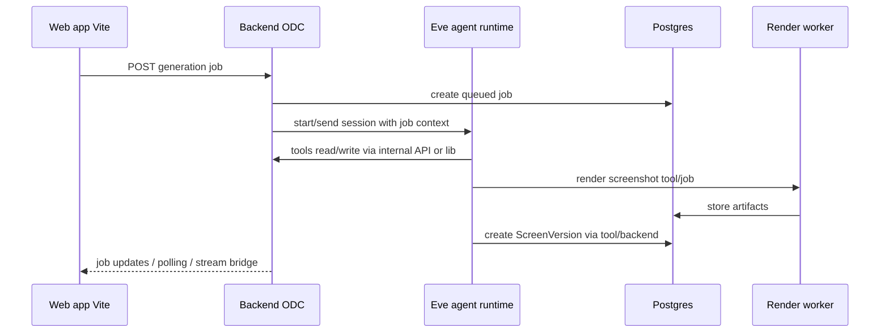

# Integration Eve pour les agents

Date: 2026-06-17

Source principale: https://eve.dev/docs/introduction

## Objectif

Ce document synthétise la documentation Eve pour décider comment l'utiliser dans Open Design Canvas.

Eve est un framework TypeScript, filesystem-first, pour construire des agents durables. Il fournit:

- une structure de projet `agent/`;
- un runtime de sessions longues et resumables;
- des tools TypeScript typés;
- des skills Markdown chargeables à la demande;
- des subagents spécialisés;
- un sandbox isolé;
- des channels HTTP ou plateformes;
- des connections vers MCP et OpenAPI;
- des evals d'agents.

Pour notre projet, Eve doit servir de runtime agentique principal pour les agents de génération, critique, export, recherche et orchestration. Le backend produit reste responsable des projets, écrans, versions, artefacts et permissions applicatives.

## Statut et contraintes

Eve est en beta. Les APIs, le comportement et la documentation peuvent changer avant la disponibilité générale. Toute intégration doit donc rester isolée derrière une couche `agent-runtime` ou un service séparé, afin de pouvoir remplacer ou faire évoluer Eve sans réécrire le modèle produit.

Pré-requis documentés:

- Node.js 24 ou plus;
- npm;
- identifiants de modèle IA;
- déploiement recommandé sur Vercel si on veut bénéficier du runtime hébergé, du sandbox Vercel et de Vercel Workflow.

Notre stack MVP actuelle cible Vite, React, Node.js, Hono ou Fastify, Postgres, Redis/BullMQ, Playwright et Sandpack. Eve ne remplace pas automatiquement toutes ces briques. Il remplace surtout la partie boucle agentique, orchestration durable, tools, subagents et interaction conversationnelle.

## Modèle mental Eve

Un agent Eve est un dossier `agent/` découvert par convention.

Exemple minimal:

```text
agent/
  agent.ts
  instructions.md
  tools/
  skills/
  connections/
  sandbox/
  subagents/
```

Les noms viennent du chemin:

| Chemin | Identité runtime |
| --- | --- |
| `agent/tools/generate_design_spec.ts` | tool `generate_design_spec` |
| `agent/skills/design_quality.md` | skill `design_quality` |
| `agent/connections/design_docs.ts` | connection `design_docs` |
| `agent/subagents/critic/agent.ts` | subagent `critic` |

Eve découvre les fichiers. Il n'y a pas de registre central à maintenir.

## Sessions, turns et durabilité

Eve organise le travail en trois niveaux:

- `session`: conversation durable, potentiellement longue de plusieurs jours;
- `turn`: un message utilisateur et tout le travail qu'il déclenche;
- `step`: checkpoint durable, typiquement un appel modèle et les tools associés.

Les sessions survivent aux redémarrages, timeouts et redeploys. Un step terminé n'est pas relancé; Eve rejoue son résultat. Un step interrompu peut être relancé. Donc les side effects non idempotents doivent être:

- idempotents côté outil;
- ou protégés par approbation humaine;
- ou déportés vers notre backend qui applique ses propres garanties.

Pour Open Design Canvas, cela implique:

- génération de DesignSpec: sûre à relancer si elle écrit seulement une proposition;
- création de `ScreenVersion`: doit être idempotente via clé de job ou `runId`;
- export, publication, mutation de projet: à protéger par tool approval ou transaction backend.

## Tools

Un tool Eve est une action TypeScript typée que le modèle peut appeler.

Exemple adapté:

```ts
import { defineTool } from "eve/tools";
import { z } from "zod";

export default defineTool({
  description: "Create a structured DesignSpec draft for an Open Design Canvas screen.",
  inputSchema: z.object({
    projectId: z.string(),
    prompt: z.string().min(1),
    deviceType: z.enum(["desktop", "mobile", "tablet"]),
  }),
  async execute(input, ctx) {
    return {
      schemaVersion: "1.0",
      projectId: input.projectId,
      deviceType: input.deviceType,
      draft: true,
    };
  },
});
```

Points importants:

- le filename devient le nom visible par le modèle;
- `inputSchema` est requis, même pour un input vide;
- `execute(input, ctx)` tourne dans l'app runtime, avec accès à `process.env`;
- les tools ne tournent pas dans le sandbox, sauf s'ils appellent explicitement `ctx.getSandbox()`;
- `toModelOutput` permet de réduire ce que le modèle voit quand le tool retourne des données riches;
- `needsApproval` permet de suspendre durablement l'exécution jusqu'à approbation.

Tools recommandés pour notre MVP:

| Tool | Rôle |
| --- | --- |
| `get_project_context` | Lire projet, DESIGN.md, écrans et contraintes depuis notre backend |
| `generate_design_spec` | Produire ou réparer un `DesignSpec` structuré |
| `validate_design_spec` | Appeler nos schemas Zod et retourner les erreurs exploitables |
| `compile_preview` | Compiler DesignSpec vers HTML/React preview |
| `render_screenshot` | Déclencher Playwright ou notre render worker |
| `create_screen_version` | Persister une version validée |
| `create_variants` | Générer plusieurs directions contrôlées |
| `prepare_export` | Préparer export HTML/React |

Les tools qui écrivent dans la base doivent recevoir des IDs explicites et idempotents: `jobId`, `projectId`, `screenId`, `baseVersionId`, `idempotencyKey`.

## Skills

Un skill est une procédure Markdown que le modèle charge seulement quand elle est pertinente. Eve expose un tool interne `load_skill` quand des skills existent.

Les skills ajoutent du contexte, pas du comportement exécutable. Le comportement exécutable reste dans les tools.

Skills recommandés:

```text
agent/skills/
  design-spec-authoring.md
  visual-critique.md
  compact-saas-ui.md
  export-react.md
  prompt-repair.md
```

Exemple:

```md
---
description: Use when creating or repairing an Open Design Canvas DesignSpec.
---

Always produce a valid DesignSpec JSON object. Preserve the user's intent,
target device, design system constraints, and existing screen structure.
Prefer structured nodes over raw HTML.
```

Bonnes règles:

- écrire la `description` comme une condition d'activation;
- garder les skills procéduraux et courts;
- mettre les helpers partagés dans `agent/lib/`;
- dupliquer un skill dans un subagent si ce subagent en a besoin, car les skills ne sont pas partagés automatiquement entre agent parent et subagent.

## Subagents

Eve fournit deux formes de subagents.

Le tool intégré `agent` délègue à une copie de l'agent courant. Cette copie partage sandbox et tools, mais démarre avec historique et state frais. C'est utile pour fan-out simple.

Les subagents déclarés vivent dans `agent/subagents/<id>/`. Ils ont leurs propres instructions, tools, connections, skills, sandbox et state. Ils n'héritent pas des slots du parent.

Subagents recommandés:

```text
agent/subagents/
  planner/
    agent.ts
    instructions.md
  generator/
    agent.ts
    instructions.md
    tools/
    skills/
  critic/
    agent.ts
    instructions.md
    tools/
    skills/
  exporter/
    agent.ts
    instructions.md
    tools/
  researcher/
    agent.ts
    instructions.md
    connections/
```

Rôle proposé:

| Subagent | Mission |
| --- | --- |
| `planner` | Transformer le brief utilisateur en plan de génération |
| `generator` | Produire DesignSpec et variantes |
| `critic` | Lire screenshot, logs et spec pour proposer corrections |
| `exporter` | Produire HTML/React/Figma payload plus tard |
| `researcher` | Consulter docs, MCP interne ou références externes |

Chaque `agent.ts` de subagent doit définir une `description`; Eve l'utilise pour décider quand déléguer.

## Sandbox

Chaque agent Eve a un sandbox isolé avec `/workspace`. Les tools intégrés `bash`, `read_file`, `write_file`, `glob` et `grep` y opèrent.

Frontière de confiance:

| Zone | Secrets | FS | Réseau |
| --- | --- | --- | --- |
| App runtime | oui | app | non restreint par défaut |
| Sandbox | non | `/workspace` isolé | contrôlé par policy |

Pour notre projet:

- garder les secrets dans l'app runtime;
- ne jamais injecter `process.env` dans le sandbox;
- utiliser le sandbox pour manipuler fichiers temporaires, scripts de transformation, analyse de bundle ou génération d'artefacts;
- utiliser notre preview sandbox navigateur séparément pour le rendu UI utilisateur;
- appliquer une network policy plus stricte que `allow-all` en production.

Fichiers seedables:

```text
agent/sandbox/
  sandbox.ts
  workspace/
    design-spec.schema.json
    examples/
```

Le sandbox peut utiliser plusieurs backends: Vercel Sandbox, Docker, microsandbox ou just-bash. Le backend par défaut choisit selon l'environnement. Pour un MVP local, Docker est probablement le plus prévisible. Pour production Vercel, Vercel Sandbox est le chemin naturel.

## Connections et MCP

Les connections exposent à l'agent des tools externes depuis:

- un serveur MCP;
- une API décrite par OpenAPI.

Un fichier `agent/connections/design_docs.ts` peut connecter un serveur MCP interne:

```ts
import { defineMcpClientConnection } from "eve/connections";

export default defineMcpClientConnection({
  url: process.env.DESIGN_DOCS_MCP_URL!,
  description:
    "Open Design Canvas project documentation, architecture decisions, DesignSpec schemas, and agent playbooks.",
  auth: {
    getToken: async () => ({ token: process.env.DESIGN_DOCS_MCP_TOKEN! }),
  },
  tools: {
    allow: [
      "search_docs",
      "read_doc",
      "read_design_schema",
      "list_agent_playbooks",
      "get_agent_playbook",
    ],
  },
});
```

Eve impose que l'URL MCP parle Streamable HTTP ou SSE. Le modèle ne voit ni URL ni credentials. Il découvre les tools via `connection__search`, puis appelle des tools qualifiés du type:

```text
connection__design_docs__search_docs
```

C'est le point clé pour notre futur MCP: on peut construire un serveur MCP commun qui sert à la fois:

- aux agents Eve;
- à Codex quand on développera ces agents;
- à d'autres assistants de dev.

## MCP interne à créer

Objectif du MCP: permettre aux agents de retrouver les documents, schemas, décisions et exemples nécessaires sans charger tout le repo dans le prompt.

Nom proposé: `open-design-canvas-knowledge-mcp`.

Transport:

- Streamable HTTP ou SSE pour Eve;
- stdio éventuellement en plus pour Codex/local dev, si utile.

Tools MCP proposés:

| Tool MCP | Description |
| --- | --- |
| `search_docs(query, tags?)` | Recherche sémantique ou textuelle dans `docs/` |
| `read_doc(path)` | Lire un document précis |
| `list_docs()` | Lister les documents disponibles avec résumé |
| `read_design_schema(version?)` | Retourner le schema DesignSpec |
| `read_api_contract(name?)` | Retourner les contrats API pertinents |
| `list_agent_playbooks()` | Lister les playbooks/skills internes |
| `get_agent_playbook(id)` | Lire un playbook agentique |
| `search_examples(query)` | Retrouver exemples DesignSpec, HTML, React |
| `get_project_context(projectId)` | Optionnel: lire contexte projet via backend sécurisé |

Ressources MCP proposées:

```text
docs://index
docs://architecture
docs://ai-pipeline
schema://design-spec/latest
playbook://generator
playbook://critic
```

Règles:

- séparer documentation statique et données projet sensibles;
- protéger les données projet avec auth utilisateur ou service;
- ne jamais exposer secrets, tokens, clés provider;
- retourner des extraits bornés, pas tout le repo par défaut;
- versionner les schemas.

## Channels et client web

Le channel Eve par défaut expose:

```text
GET  /eve/v1/health
POST /eve/v1/session
POST /eve/v1/session/:sessionId
GET  /eve/v1/session/:sessionId/stream
```

Les streams sont en NDJSON. Les événements utiles UI incluent:

- `message.received`;
- `message.appended`;
- `actions.requested`;
- `action.result`;
- `input.requested`;
- `result.completed`;
- `session.waiting`;
- `session.failed`.

Deux options d'intégration web:

1. Garder notre app Vite et appeler Eve comme service agentique séparé via `eve/client` depuis le backend.
2. Migrer plus tard vers Next.js et utiliser `withEve()` + `useEveAgent()` en same-origin.

Recommandation MVP: ne pas migrer vers Next.js maintenant. Garder l'architecture Vite + API backend et intégrer Eve côté backend/worker. Eve devient le runtime agentique derrière nos endpoints `/api/projects/:projectId/generation-jobs`.

Flux recommandé:



Plus tard, si on veut un chat agentique direct dans le navigateur, on peut exposer une session Eve au frontend et utiliser les hooks Eve. Mais il faut alors aligner l'auth production.

## Auth et sécurité

Eve échoue fermé par défaut pour les routes HTTP. En production, `localDev()` et `vercelOidc()` ne suffisent pas pour des utilisateurs navigateur. Il faut brancher notre auth produit.

Checklist:

- remplacer tout `placeholderAuth()`;
- vérifier qu'une requête production non authentifiée retourne `401`;
- ne jamais faire confiance à un `principalId` envoyé dans le body;
- vérifier les signatures de channels externes en temps constant;
- limiter les tools et connections sensibles avec `needsApproval`, `approval: once()` ou `approval: always()`;
- limiter les outputs tools visibles par le modèle avec `toModelOutput`;
- mettre le sandbox en allow-list réseau pour les workloads sensibles;
- garder les credentials MCP/OpenAPI dans `process.env` ou un secret manager.

## State

`defineState` fournit une mémoire durable par session. Elle est utile pour:

- budget de génération;
- plan courant;
- checklist d'itération;
- historique court d'objectifs utilisateur;
- compteur de réparations automatiques.

Elle ne remplace pas Postgres. Tout ce qui doit être partagé entre sessions, requêté hors session ou conservé comme donnée produit reste en base.

## Evals

Eve peut découvrir des evals dans `evals/**/*.eval.ts`. Les evals pilotent un vrai serveur Eve via le protocole client et vérifient:

- fin de run;
- tools appelés;
- ordre des tools;
- contenu de réponse;
- jugements LLM optionnels.

Evals recommandées:

- génération simple d'un dashboard desktop;
- réparation d'un DesignSpec invalide;
- refus de créer une version si validation échoue;
- appel obligatoire de `validate_design_spec` avant `create_screen_version`;
- critique visuelle retourne une liste structurée d'issues;
- export React n'écrit pas de dépendances non supportées.

## Proposition d'architecture cible

Structure de repo future possible:

```text
apps/
  web/                  # Vite React
  api/                  # Hono/Fastify backend produit
  agent-runtime/         # Eve app
packages/
  design-spec/           # schemas Zod + compilateur
  db/                    # Drizzle schema
  mcp-knowledge/          # serveur MCP docs/schemas/playbooks
```

Structure Eve dans `apps/agent-runtime/`:

```text
agent/
  agent.ts
  instructions.md
  channels/
    eve.ts
  connections/
    odc_knowledge.ts
  lib/
    api-client.ts
    design-spec.ts
    idempotency.ts
  skills/
    design-spec-authoring.md
    visual-critique.md
    export-react.md
  tools/
    get_project_context.ts
    validate_design_spec.ts
    create_screen_version.ts
    render_screenshot.ts
    prepare_export.ts
  subagents/
    generator/
    critic/
    exporter/
  sandbox/
    sandbox.ts
    workspace/
      examples/
evals/
  generation-smoke.eval.ts
  repair-invalid-spec.eval.ts
```

## Décision recommandée

Adopter Eve pour le runtime agentique, mais ne pas remplacer le backend métier.

Pour le MVP:

1. Créer un package/app `agent-runtime` isolé.
2. Brancher Eve sur notre backend via tools internes idempotents.
3. Créer un MCP documentaire interne pour docs, schemas et playbooks.
4. Connecter ce MCP à Eve via `defineMcpClientConnection`.
5. Garder les jobs produits dans notre API existante.
6. Ajouter des evals Eve pour les comportements critiques d'agents.

Plans d'implémentation associés:

- [Plan 7: runtime agents Eve](plans/07-agent-runtime-eve.md)
- [Plan 8: MCP connaissance](plans/08-knowledge-mcp.md)

Ce découpage garde notre produit portable: si Eve change fortement pendant sa beta, le contrat interne reste centré sur `DesignSpec`, `GenerationJob`, `ScreenVersion` et nos APIs.

## Sources consultees

- Eve introduction: https://eve.dev/docs/introduction
- Sitemap documentation: https://eve.dev/sitemap.md
- Contexte LLM complet: https://eve.dev/llms.txt
- Agents metadata: https://eve.dev/agents.md
- Project layout: https://eve.dev/docs/reference/project-layout
- Tools: https://eve.dev/docs/tools
- Skills: https://eve.dev/docs/skills
- Subagents: https://eve.dev/docs/subagents
- Connections/MCP: https://eve.dev/docs/connections
- Sandbox: https://eve.dev/docs/sandbox
- Execution model: https://eve.dev/docs/concepts/execution-model-and-durability
- Default harness: https://eve.dev/docs/concepts/default-harness
- Security model: https://eve.dev/docs/concepts/security-model
- Eve channel: https://eve.dev/docs/channels/eve
- TypeScript client: https://eve.dev/docs/guides/client/overview
- Streaming: https://eve.dev/docs/guides/client/streaming
- Next.js integration: https://eve.dev/docs/guides/frontend/nextjs
- Dynamic capabilities: https://eve.dev/docs/guides/dynamic-capabilities
- State: https://eve.dev/docs/guides/state
- Evals: https://eve.dev/docs/evals/overview
